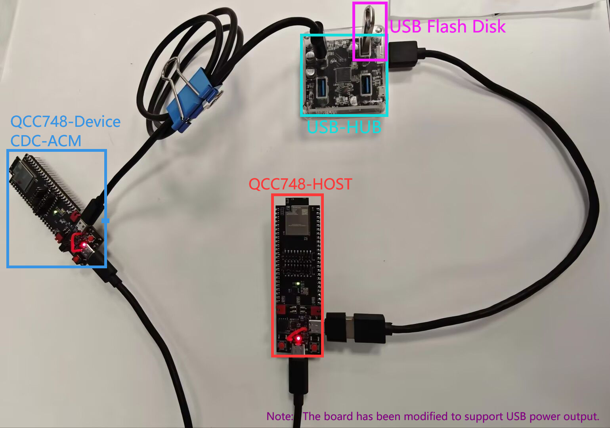

# cherryusb

## OverView

This example demonstrates ​​USB device and host mode functionalities​​ on an embedded system, supporting various USB classes such as ​​CDC-ACM, RNDIS, UVC, UAC, MSC, HID, and ECM​​. It enables communication between the embedded device and a host PC (Windows/Linux) or another embedded board acting as a USB host.

## Support CHIP

|      CHIP        |   BOARD   |  Remark   |
|:-----------------|:----------|:----------|
|QCC743/QCC744     |  QCC74x   |           |

## Compile

- QCC743/QCC744

```
make CHIP=qcc743 BOARD=qcc74x_undefk
```


## Flash

```
make flash CHIP=chip_name COMX=xxx # xxx is your com name
```

## ​Key Features​​

### ​​USB Device Mode (Slave)​​:

- ​CDC-ACM​​: Virtual serial port (COM) for bidirectional communication.
- ​​RNDIS/ECM​​: Ethernet-over-USB (Windows/Linux - recognizes it as a network adapter).
- ​​UVC (USB Video Class)​​: Simulates a webcam for video streaming.
- ​​UAC (USB Audio Class)​​: Simulates an audio device for playback/recording.
- ​​MSC (Mass Storage Class)​​: Emulates a USB flash drive for file storage.
- ​​HID (Human Interface Device)​​: Simulates a keyboard/mouse.
### ​​USB Host Mode (Master)​​:

- ​​CDC-ACM Host​​: Communicates with a USB CDC-ACM device (e.g., another embedded board).
- ​HID Host​​: Reads input from USB keyboards/mice.
- MSC Host​​: Reads/writes to USB storage devices (FATFS support).
### Testing & Debugging Commands​​:
- usbd_cdc_acm_test, usbd_rndis_test, usbd_uvc_mjpeg_test, etc., initialize different USB device modes.
- usbh_start, usbh_stop control host mode.
- lsusb lists connected USB devices.

## How to use example

**The key test commands will be explained in the order of the required hardware, serial terminal input logs, visualization of results, and notes (optional).**  
**Advice:** Try sending `help` followed by the Enter key in the serial command line to learn about the available commands.


### Testing & Debugging Commands
Below are some commonly used commands for testing and debugging:

|      Commands        |   Function Description   |
|:---------------------|:-------------------------|
|`free` | The size of the idle addresses for SRAM and PSRAM  |
|`memtrace` | Read and write memory  |
|`help` | Bout the available commands | 
|`ps` | The status of processes in the current system  |
|`mfg` | Conduct comprehensive testing of hardware functionality before leaving the factory  |
|`sysver ` | System Version  |
|`usbd_stop` | Stop the USB devices from operating in the USB slave mode  |
|`lsusb` | List USB devices  |
|`usbh_stop` | Stop the USB devices from operating in the USB host mode  |
|`usbh_start` | Start the USB devices from operating in the USB host mode  |

### Example Commands

#### **1. Command:** `usbd_cdc_acm_test`  
**Function Description:** Initialize a USB device that supports CDC-ACM protocols  
**Hardware:** Windows/Linux PC, Two Type-C to Type-A data cables  

**Note:** A virtual serial interface will be generated in the Device Manager upon successful completion. It is necessary to use `usbd_stop` to shut down. When you open a virtual serial port using a serial terminal and activate the DTR (Data Terminal Ready) signal at the same time, the port enters loopback mode, causing any data transmitted from the virtual serial port to be received back on the same port. 

Serial port printing display：
``` 
IACM Create USB device cdc_acm data send task...
IACM usbd cdc_acm machine start/restart 
I/USB CDC_ACM USBD_EVENT_RESET
I/USB CDC_ACM configured done
IACM USBD ACM Ready!
IACM DTR clear, Exit the loopback test mode
```

Loopback test mode Serial port printing display：
```
IACM DTR set, Enter the loopback test mode
```

Windows Device Manager Virtual Serial Port Display:
<div align="center" style="margin-top: 2em; margin-bottom: 2em;">
      
</div> 

Linux Terminal Virtual Serial Port Display:
```
$ sudo dmesg -w
[664826.119339] usb 1-3: new high-speed USB device number 10 using xhci_hcd
[664826.514987] usb 1-3: New USB device found, idVendor=ffff, idProduct=ffff, bcdDevice= 1.00
[664826.514991] usb 1-3: New USB device strings: Mfr=1, Product=2, SerialNumber=3
[664826.514992] usb 1-3: Product: CherryUSB_CDC_ECM_DEMO
[664826.514993] usb 1-3: Manufacturer: CherryUSB
[664826.514994] usb 1-3: SerialNumber: 2022123456
[664826.558607] cdc_ether 1-3:1.0 eth0: register 'cdc_ether' at usb-0000:00:14.0-3, CDC Ethernet Device, 18:b9:05:12:34:56
[664826.558639] usbcore: registered new interface driver cdc_ether
[664826.565021] cdc_ether 1-3:1.0 enx18b905123456: renamed from eth0
[665041.124265] usb 1-3: USB disconnect, device number 10
[665041.124390] cdc_ether 1-3:1.0 enx18b905123456: unregister 'cdc_ether' usb-0000:00:14.0-3, CDC Ethernet Device
```

#### **2. Command:** `usbd_cdc_ecm_test`  
**Function Description:** Initialize a USB device that emulates an Ethernet interface  
**Hardware:** Linux PC, Two Type-C to Type-A data cables, A network cable  

**Note:** Please use the Ethernet board. It is necessary to use `usbd_stop` to shut down.

Serial port printing display：
```
IEPHY eth phy scan success, phy_addr: 1, phy_id: 0x02430C54
WEPHY drv_match falied, use General driver
IECM Create USB device cdc_ecm <-> emac task...
qcc74x />
qcc74x />IECM USB device cdc_ecm <-> emac task start...
IECM usbd rndis machine start/restart 
WETH_EMAC Eth Emac ReStart (LinkDown) !!!
I/USB CDC_ECM USBD_EVENT_CONFIGURED
IECM USBD ECM EMAC Ready!
WETH_EMAC Eth Emac LinkUp !!!
IETH_EMAC TX_BUF_CNT:0, RX_BUF_CNT:10
IETH_EMAC eth_phy speed: 100M_FULL_DUPLEX
IECM USBD ECM IN/RX start
IECM USBD ECM OUT/TX start

IETH_EMAC TX: success cnt:0, error cnt:0, total size:0Byte
IETH_EMAC     push_cnt:0, tx_db waiting:0, tx_bd_ptr:0
IETH_EMAC RX: success cnt:0, error cnt:0, total size:0Byte
IETH_EMAC     push_cnt:10, rx_db waiting:10, rx_bd_ptr:0, busy cnt:0
```

Linux Terminal Virtual Network Port Display:
```
$ sudo dmesg -w
[664826.119339] usb 1-3: new high-speed USB device number 10 using xhci_hcd
[664826.514987] usb 1-3: New USB device found, idVendor=ffff, idProduct=ffff, bcdDevice= 1.00
[664826.514991] usb 1-3: New USB device strings: Mfr=1, Product=2, SerialNumber=3
[664826.514992] usb 1-3: Product: CherryUSB_CDC_ECM_DEMO
[664826.514993] usb 1-3: Manufacturer: CherryUSB
[664826.514994] usb 1-3: SerialNumber: 2022123456
[664826.558607] cdc_ether 1-3:1.0 eth0: register 'cdc_ether' at usb-0000:00:14.0-3, CDC Ethernet Device, 18:b9:05:12:34:56
[664826.558639] usbcore: registered new interface driver cdc_ether
[664826.565021] cdc_ether 1-3:1.0 enx18b905123456: renamed from eth0

$ ifconfig 
enx18b905123456: flags=4163<UP,BROADCAST,RUNNING,MULTICAST>  mtu 1500
        inet 10.28.30.186  netmask 255.255.255.0  broadcast 10.28.30.255
        inet6 fe80::7b6e:119c:c26:e462  prefixlen 64  scopeid 0x20<link>
        ether 18:b9:05:12:34:56  txqueuelen 1000  (Ethernet)
        RX packets 2382  bytes 414519 (414.5 KB)
        RX errors 0  dropped 215  overruns 0  frame 0
        TX packets 208  bytes 30106 (30.1 KB)
        TX errors 0  dropped 0 overruns 0  carrier 0  collisions 0
```

#### **3. Command:** `usbd_cdc_rndis_test`  
**Function Description:** Initialize a USB RNDIS (Remote NDIS) device  
**Hardware:** Windows PC, Two Type-C to Type-A data cables, A network cable  

**Note:** Please use the Ethernet board. It is necessary to use `usbd_stop` to shut down.  

Serial port printing display：
```
IEPHY eth phy scan success, phy_addr: 1, phy_id: 0x02430C54
WEPHY drv_match falied, use General driver
IRNDIS Create USB device cdc_rndis <-> emac task...
IRNDIS USB device cdc_rndis <-> emac task start...
IRNDIS usbd rndis machine start/restart 
WETH_EMAC Eth Emac ReStart (LinkDown) !!!
I/USB CDC_RNDIS USBD_EVENT_CONFIGURED
IRNDIS USBD RNDIS EMAC Ready!
WETH_EMAC Eth Emac LinkUp !!!
IETH_EMAC TX_BUF_CNT:0, RX_BUF_CNT:10
IETH_EMAC eth_phy speed: 100M_FULL_DUPLEX
IRNDIS USBD RNDIS IN/RX start
IRNDIS USBD RNDIS OUT/TX start

IETH_EMAC TX: success cnt:0, error cnt:0, total size:0Byte
IETH_EMAC     push_cnt:0, tx_db waiting:0, tx_bd_ptr:0
IETH_EMAC RX: success cnt:0, error cnt:0, total size:0Byte
IETH_EMAC     push_cnt:10, rx_db waiting:10, rx_bd_ptr:0, busy cnt:0
```
Windows Settings Network and Internet Port Display:
<div align="center" style="margin-top: 2em; margin-bottom: 2em;">
      
</div> 

#### **4. Command:** `usbd_hid_keyboard_test`  
**Function Description:** Initialize a virtual USB keyboard device  
**Hardware:** Windows/Linux PC, Two Type-C to Type-A data cables  

**Note:** Be cautious when clicking on an input field with your mouse, as it may continuously send 'a'. It is necessary to use `usbd_stop` to shut down.

Serial port printing display：
```
IUSBD_CLI Create USB device usbd_hid_keyboard task...
IUSBD_CLI usbd_hid_keyboard_task run
IUSBD_CLI hid_keyboard_init done
I/USB HID KeyBoard configured done
```

#### **5. Command:** `usbd_msc_test`  
**Function Description:** Initialize a USB device that supports MSC protocols  
**Hardware:** Windows/Linux PC, Two Type-C to Type-A data cables  

**Note:** A virtual USB drive will be inserted during the successful jump. It is necessary to use `usbd_stop` to shut down.

Serial port printing display：
```
I/USB MSC configured done
```


#### **6. Command:** `usbd_uac_v1_test`  
**Function Description:** Initialize a USB Audio Class v1.0 device  
**Hardware:** Windows PC, Two Type-C to Type-A data cables  

**Note:** Please turn on the video recorder to display 'UAC OPEN' on the serial port. It will continue to send high-frequency audio data. It is necessary to use `usbd_stop` to shut down.

Serial port printing display：
```
IUSBD_CLI Create USB device usbd_uac_v1 task...
IUSBD_CLI usbd_uac_v1_task run
IUSBD_CLI uac_v1_init done
I/USB UAC configured done
I/USB UAC OPEN SPK
```
Windows Terminal UAC Recorder Display:
<div align="center" style="margin-top: 2em; margin-bottom: 2em;">
      
</div> 

#### **7. Command:** `usbd_uvc_mjpeg_test`  
**Function Description:** Initialize a USB Video Class device  
**Hardware:** Windows PC, Two Type-C to Type-A data cables  

**Note:** Please open the camera application to display 'UVC OPEN' on the serial port. It is necessary to use `usbd_stop` to shut down.

Serial port printing display：
```
IUSBD_CLI Create USB device usbd_uvc_mjpeg task...
IUSBD_CLI usbd_uvc_mjpeg_task run
IUSBD_CLI uvc_mjpeg_init done
I/USB UVC configured done
I/USB UVC OPEN
```

Windows Terminal UVC Camera Display:
<div align="center" style="margin-top: 2em; margin-bottom: 2em;">
      
</div> 

#### **8. Command:** `usbd_cdc_acm_msc_test`  
**Function Description:** Initialize a USB device that supports both CDC-ACM and MSC protocols  
**Hardware:** Windows/Linux PC 、 Two Type-C to Type-A data cables

**Note:** A virtual USB drive was inserted during the successful jump. Its effect is consistent with that of usbd_cdc_acm_test and usbd_msc_test. It is necessary to use `usbd_stop` to shut down.

Serial port printing display：
```
IACM_MSC Create USB device cdc_acm data send task...
IACM usbd cdc_acm machine start/restart 
I/USB MSC CDC_ACM configured done
IACM USBD ACM Ready!
IACM DTR clear, Exit the loopback test mode
```

The following will provide a detailed introduction to the host mode of USB.
-

**Hardware:**
Two QCC748 chip development boards with USB interfaces, a USB hub, and a USB flash drive formatted with the FAT32 file system. If your development board's USB does not support external power, you will need a powered hub or devices that do not require USB power.



**Note:** In case your board doesn't have micro-USB connector connected to USB peripheral, you may have to DIY a cable and connect D+ and D- to the pins

After the flashing you should see this output:
```
[I/USB] usb host start!
[I/USB] EHCI HCIVERSION:0x0100
[I/USB] EHCI HCSPARAMS:0x000001
[I/USB] EHCI HCCPARAMS:0x0006
[I/USB] EHCI ppc:0, n_ports:1, n_cc:0, n_pcc:0
[I/USB] EHCI uses tt for ls/fs device
```
When connected to the USB HUB, you will see the following output:

```
[I/USB] New high-speed device on Hub 1, Port 1 connected
[I/USB] New device found,idVendor:2109,idProduct:2817,bcdDevice:0214
[I/USB] The device has 1 interfaces
[I/USB] Enumeration success, start loading class driver
[I/USB] Loading hub class driver
Hub Descriptor:
bLength: 0x09             
bDescriptorType: 0x29     
bNbrPorts: 0x04           
wHubCharacteristics: 0x00e9 
bPwrOn2PwrGood: 0xaf      
bHubContrCurrent: 0x64    
DeviceRemovable: 0x00     
PortPwrCtrlMask: 0xff     
[I/USB] Ep=81 Attr=03 Mps=1 Interval=12 Mult=00
[I/USB] port 1, status:0x100, change:0x00
[I/USB] port 2, status:0x100, change:0x00
[I/USB] port 3, status:0x100, change:0x00
[I/USB] port 4, status:0x100, change:0x00
[I/USB] Register HUB Class:/dev/hub2
```

Then, plug the USB flash drive formatted with the FAT32 file system into the USB HUB. After the host enumerates the MSC device, it will use FatFs to mount the file system and perform read/write speed tests. You will see the following output:

```
[I/USB] New high-speed device on Hub 2, Port 1 connected
[I/USB] New device found,idVendor:04e8,idProduct:61fd,bcdDevice:0005
[I/USB] The device has 1 interfaces
[I/USB] Enumeration success, start loading class driver
[I/USB] Loading msc class driver
[I/USB] Get max LUN:1
[I/USB] Ep=81 Attr=02 Mps=512 Interval=00 Mult=00
[I/USB] Ep=02 Attr=02 Mps=512 Interval=00 Mult=00
[E/USB] csw bStatus 1
[I/USB] Capacity info:
[I/USB] Block num:15486976,block size:512
[I/USB] Register MSC Class:/dev/sda

[I/USB] ******************** be about to write test... **********************
[I/USB] Write Test Succeed! 
[I/USB] Single data size:32768 Byte, Write the number:1024, Total size:32768 KB
[I/USB] Time:1766ms, Write Speed:18554 KB/s 

[I/USB] ******************** be about to read test... **********************
[I/USB] Read Test Succeed! 
[I/USB] Single data size:32768Byte, Read the number:1024, Total size:32768 KB
[I/USB] Time:1496ms, Read Speed:21903 KB/s 

[I/USB] ******************** be about to check test... **********************
[I/USB] Check Test Succeed! 
[I/USB] All Data Is Good! 
```

After flashing the other board via the USB port, enter the command `usbd_cdc_acm_test` in slave mode. For details on the serial port output, please refer to the description of the `usbd_cdc_acm_test` command. Then, connect the board to the HUB. A CDC-ACM loopback speed test will be initiated automatically.
Please note that the current host-side test code is not optimized for performance, so the measured transfer speeds may appear lower than expected. The output will be similar to the following: 

```
[I/usbh_hub] New high-speed device on Bus 0, Hub 1, Port 1 connected
[I/usbh_core] New device found,idVendor:ffff,idProduct:ffff,bcdDevice:0100
[I/usbh_core] The device has 1 bNumConfigurations
[I/usbh_core] The device has 2 interfaces
[I/usbh_core] Enumeration success, start loading class driver
[I/usbh_core] Loading cdc_acm class driver
[I/usbh_cdc_acm] Ep=04 Attr=02 Mps=512 Interval=00 Mult=00
[I/usbh_cdc_acm] Ep=83 Attr=02 Mps=512 Interval=00 Mult=00
[I/usbh_cdc_acm] Register CDC ACM Class:/dev/ttyACM0
USBH ACM speed test start
[I/usbh_core] Loading cdc_data class driver
USBH ACM test time: 2000
USBH ACM out size: 23160832
USBH ACM in size: 23160907
USBH ACM out speed: 11309 KB/S
USBH ACM in speed: 11309 KB/S
USBH ACM total speed: 22618 KB/S
USBH ACM speed test end
```

### Technical Details

None 

## Limitation

None

## Reference

None