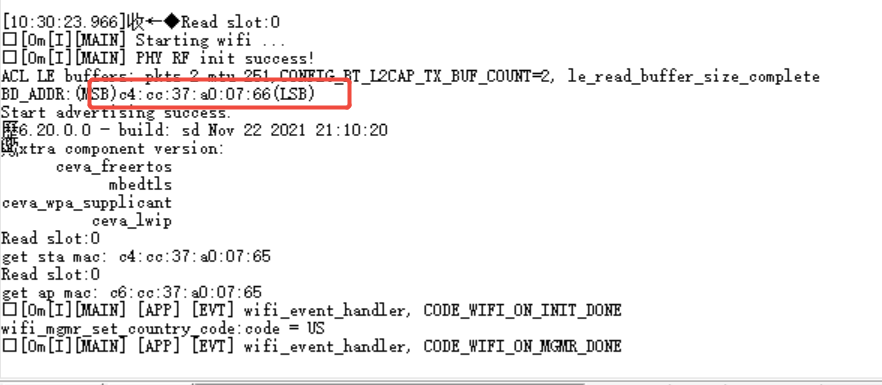
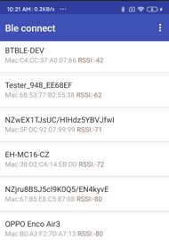
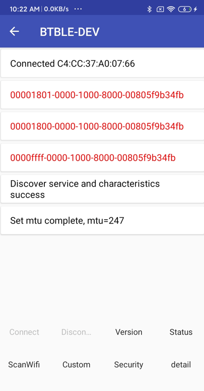
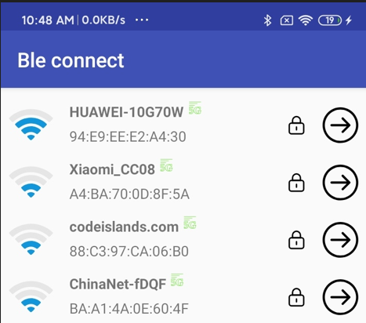
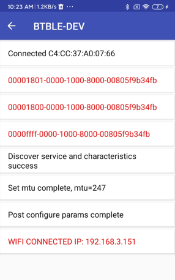

# wifi6

## Support CHIP

|      CHIP        | Remark |
|:----------------:|:------:|
|qcc743/qcc744       |        |

## Compile

- qcc743/qcc744

```
make CHIP=qcc743 BOARD=qcc743dk
```

## Flash

```
make flash COMX=xxx ## xxx is your com name
```

## BLE WiFi Provisioning

This section describes how to provision WiFi credentials to the QCC74x device using Bluetooth Low Energy (BLE).

### Prerequisites

1.  Ensure the QCC74x device is powered on and running the `smartconfig_ble` example.
2.  Have a BLE provisioning application installed on your smartphone or computer. This application should be capable of scanning for BLE devices, connecting to them, and sending WiFi credentials.

### Provisioning Steps

1.  **Device Startup**: Boot up the QCC74x device. Upon startup, it will automatically enter BLE provisioning mode, waiting for a connection from the provisioning app.
    <p align="center"></p>

2.  **Scan for Devices**: Open the BLE provisioning app on your smartphone or computer. Initiate a scan for nearby BLE devices. The QCC74x device should appear in the list of discoverable devices (typically identified by a name like "BTBLE-DEV" or similar).
    <p align="center"></p>

3.  **Connect to Device**: Select the QCC74x BLE device from the list in the provisioning app and establish a connection.
    <p align="center"></p>

4.  **Initiate WiFi Scan**: Once connected, locate and press the "Scanwifi" button within the provisioning app. This command instructs the QCC74x device to scan for available WiFi networks.

5.  **Select WiFi Network and Enter Password**: The provisioning app will display a list of WiFi networks detected by the QCC74x device. Select your desired WiFi network from the list. You will then be prompted to enter the password for the selected network.
    <p align="center"></p>

6.  **Provisioning and Connection**: After entering the password, confirm the action. The provisioning app will securely transmit the WiFi SSID and password to the QCC74x device over the BLE connection. The device will then attempt to connect to the specified WiFi network.

7.  **Confirmation**: Wait for the QCC74x device to successfully connect to the WiFi network. The provisioning app will receive a confirmation and display a "WiFi Connected" status message along with the IP address assigned to the QCC74x device.
    <p align="center"></p>
